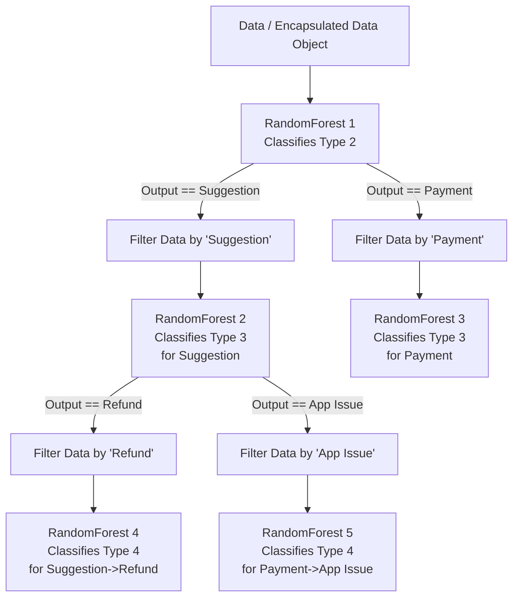

# Continuous Assessment 1 - Engineering and Evaluating AI

## Design Choice 1: Chained Multi-outputs

**Sketch for Design Choice 1**
*(You can run the block below in any Mermaid diagram viewer like mermaid.live to generate the image for your sketch, or copy-paste the structure)*

```mermaid
flowchart TD
    %% Define components
    subgraph Controller
        Main[main.py]
    end
    
    subgraph Data Flow
        Raw[Raw CSV]
        Prep[preprocess.py<br/>De-dup, Translate, Drop Type 1]
        Emb[embeddings.py<br/>TF-IDF]
        Encapsulation[data_model.py<br/>Data Class]
    end
    
    subgraph Chained Targets
        T1[Target 1: Type 2]
        T2[Target 2: Type 2 + Type 3]
        T3[Target 3: Type 2 + Type 3 + Type 4]
    end
    
    subgraph Model Abstraction
        Base[model/base.py]
        RF[model/randomforest.py]
        RF -- Inherits --> Base
    end
    
    %% Flow
    Raw --> Prep --> Emb --> Encapsulation
    Encapsulation --> T1
    Encapsulation --> T2
    Encapsulation --> T3
    
    T1 -. passed via method .-> RF
    T2 -. passed via method .-> RF
    T3 -. passed via method .-> RF
    
    Main ==> Raw
    Main ==> Chained Targets
    Main ==> RF
```

**Identify All Components for Overall Architecture for Design Choice 1**
1. **Controller Component:** `main.py`
2. **Configuration Component:** `Config.py`
3. **Preprocessing Component:** `preprocess.py` (Handles deduplication, missing values, dropping "Type 1", translation)
4. **Embedding Component:** `embeddings.py` (Translates textual summary and content into numeric TF-IDF values)
5. **Data Encapsulation Component:** `data_model.py` containing the `Data` class (Manages multi-label chained groupings `Type 2`, `Type 2+3`, `Type 2+3+4` and splitting/filtering rules)
6. **Abstract Base Model Component:** `model/base.py` (`BaseModel` module acting as a common interface)
7. **RandomForest Component:** `model/randomforest.py` (Implements ML training and inference)

**Identify All Connectors for Overall Architecture for Design Choice 1**
1. **Method/Function Invocation:** Used heavily by `main.py` calling `load_data()`, `preprocess_data()`, `get_data_object()` etc.
2. **Object Instantiation & Passing:** The initialized `Data` object (containing dataset variables X_train, y_train, etc.) is passed directly as arguments to the ML constructors and `train()` methods.
3. **Inheritance (Object-Oriented Connector):** `RandomForest` connects to the `BaseModel` via class inheritance, forcing standard method signatures.
4. **File Import/Shared State:** All active files import `Config.py` to share string literals consistently.

**Identify Data Element(s) for Overall Architecture for Design Choice 1**
1. **Raw Pandas Dataframe:** Standard tabular data imported from CSV mapping features `Ticket Summary`, `Interaction content`.
2. **TF-IDF ND-Array:** Matrix representing feature encodings (`X`).
3. **The Data Object:** An encapsulated structure containing `.X_train`, `.X_test`, `.y_train`, and `.y_test`, dynamically created for each chained multi-output sequence target.

---

## Design Choice 2: Hierarchical Modelling

**Sketch for Design Choice 2**
*(Use mermaid.live for the image)*



**Identify All Components for Overall Architecture for Design Choice 2**
1. **Controller / Dispatcher:** `main.py`
2. **Preprocessing & Embedding Components:** `preprocess.py`, `embeddings.py`
3. **Hierarchical Data Manager:** An extended `data_model.py` which dynamically applies subset filters based on prior classifications.
4. **Base Model Component:** `model/base.py`
5. **Multiple Random Forest Instances (Component Instances):** Multiple overlapping model instances based on `randomforest.py`. Every unique class from a prior target instantiates a unique component instance.

**Identify All Connectors for Overall Architecture for Design Choice 2**
1. **Method/Function Invocation:** Main controller calling scripts.
2. **Sequential Loop Control:** In `modelling.py`, logic connecting the output/predictions iteratively back into data filtering mechanisms.
3. **Data Passing / Object Instantiation:** Encapsulated subset `.iloc` DataFrames passed respectively to lower-tier RF instances.

**Identify Data Element(s) for Overall Architecture for Design Choice 2**
1. **Base Training Encapsulation:** Master Data object for Tier 1 (`Type 2`).
2. **Filtered Subset Arrays/DataFrames:** Smaller slice Data objects specifically sliced per class-condition (`Type 3` where `Type 2` == 'A').
3. **Cascading Label Predictions:** Output Series/Arrays returned from higher levels used as row-indices for the next tier's inputs.